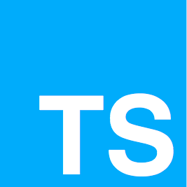

  

Typescript Fundamentals Begginners Tutorial
=====================

Prerequisites for current course / What you need to know
=====================

Topics include
===================== 

Section 1. Course Introduction
=====================
1.1. Welcome
---------------------

Section 2. Introduction Typescript
=====================
2.1. What is Typescript?
---------------------
- Typescript is Open source/free development language
- Developed and maintained by Microsoft
- Typed superset of JavaScript which Compiles to plain JavaScript
- It consists of variables Data Types string, number, boolean, etc. but it is optional
- One can write safer/meaningful/easily maintainable/scalable code
- The developer can Identify mistakes during development (scope of the variable, function parameter, variable datatype mismatch, etc.)
- Angular latest version uses typescript as an official/primary development language
- Typescript = ECMAScript 5 + 6 + 7 + Latest features

2.2. Declarations and Annotations
---------------------
